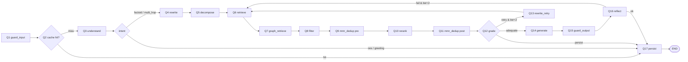

# PHẦN D — PIPELINE ORCHESTRATION (24-step canonical · 32-step observable)

> **Last-updated**: 2026-05-12 (Pipeline-Opt S8 docs sync — 32-step observable reality post ZeroEntropy migrate).
> **Source-of-truth**: `src/ragbot/orchestration/query_graph.py` + `application/services/document_service/` (package: `ingest_core.py::_IngestMixin.ingest()` orchestrator + `ingest_stages*.py` U1–U7 phases).
>
> **24-step vs 32-step**:
> - **24-step** = canonical LangGraph node count (this doc's section 16 + 17). One node = one logical phase.
> - **32-step** = observable `request_steps` rows in production trace. Sub-steps inside `retrieve` / `rerank` / `grade` / `guard_output` show up as separate tracker rows because the orchestrator instruments them individually. See [§17.4 Observable 32-step trace](#174-observable-32-step-trace-production-reality) for the mapping.

## 15. Hai Graph Độc Lập

Kiến trúc có **2 state graph riêng biệt**:
- **Upload (Ingestion) Graph** — 7 step (U1-U7): async job, chạy khi có document mới
- **Query Graph** — 17 step (Q1-Q17): chạy mỗi request chat

Không gọi nhau trực tiếp — giao tiếp qua vector store (`document_chunks`) + event bus (Redis Streams). Tách để scale riêng, deploy riêng, fail riêng.

## 16. Upload Pipeline (7 step — U1 → U7)

```
Raw Content
    │
    ▼
[U1] VALIDATE ──────────── size guard (max 500k chars) + source_url dedup + content_hash dedup
    │
    ▼
[U2] PARSE ─────────────── mime detect → parser registry (excel/sheets/pdf/md/null)
    │
    ▼
[U3] CLEAN ─────────────── NFC normalize → hyphenation fix → whitespace collapse → prompt-injection strip
    │
    ▼
[U4] CHUNK ─────────────── analyze_document() → strategy score → select:
    │                       table_csv / recursive / hdt / semantic / hybrid / proposition
    ▼
[U5] ENRICH ────────────── whole-doc bypass → parent-child split → CR (contextual retrieval) enrichment → metadata extract
    │
    ▼
[U6] VN SEGMENT ────────── underthesea compound segmentation (P22, optional, per-bot)
    │
    ▼
[U7] EMBED + STORE ─────── LiteLLMEmbedder → pgvector document_chunks + tsvector BM25 + HNSW index
    │
    ▼
 [Done — N chunks stored, embedding 100% (Phase 2.9 fix raises on length mismatch — no NULL)]
```

### 16.1 Files

| Step | Source file | Function |
|---|---|---|
| U1 VALIDATE | `application/services/document_service/ingest_core.py` | `_IngestMixin.ingest()` size guard + dedup |
| U2 PARSE | `infrastructure/parser/registry.py` + adapters | `parse(mime, content)` |
| U3 CLEAN | `shared/text_normalization.py` + `_clean_document_text()` | NFC + injection strip |
| U4 CHUNK | `shared/chunking/` package (`__init__.smart_chunk()` dispatch + `strategies.py` + `analyze.py`) | strategy registry |
| U5 ENRICH | `application/services/contextual_chunk_enrichment.py` | parent-child + CR |
| U6 VN SEGMENT | `shared/vi_tokenizer.py` | underthesea segment |
| U7 EMBED+STORE | `infrastructure/embedding/litellm_embedder.py` + `pgvector_store.upsert_chunks()` | embed_batch + INSERT |

## 17. Query Pipeline (17 step — Q1 → Q17)

```
User Message
    │
    ▼
[Q1]  GUARD INPUT ──────── input guardrail (length / injection / PII / secrets)
    │
    ▼
[Q2]  CHECK CACHE ──────── exact hash → semantic similarity pgvector (threshold 0.97) → HIT? return
    │  MISS
    ▼
[Q3]  UNDERSTAND QUERY ─── intent classify + condense (merged 1 LLM call)
    │  OOS / greeting → Q17 PERSIST (early exit)
    ▼
[Q4]  REWRITE ──────────── HyDE-style rewrite for short queries
    │
    ▼
[Q5]  DECOMPOSE ────────── multi-hop sub-query decomposition (if enabled)
    │
    ▼
[Q6]  RETRIEVE ─────────── abbrev expand → vocab enrich → metadata filter →
    │                       multi-query expand → hybrid search (dense+BM25 RRF) →
    │                       fallback ladder → diacritic BM25 → permission filter →
    │                       parent-child expand → autocut → superlative enrichment
    ▼
[Q7]  GRAPH RETRIEVE ───── GraphRAG knowledge-graph traversal (default disabled)
    │
    ▼
[Q8]  RETRIEVE FILTER ──── min-score filter (0.005 since L9, post-rerank quality gate)
    │
    ▼
[Q9]  MMR DEDUP ────────── remove redundant chunks (cosine threshold 0.88)
    │
    ▼
[Q10] RERANK ───────────── reranker_resolver (Redis → DB) → build_reranker (registry) →
    │                       ZeroEntropy zerank-2 (default) / Jina / LiteLLM / ViRanker / Null
    │                       API call → min-score filter
    │                       [ZeroEntropy zerank-2 ACTIVE per-bot since 2026-05-12 ZE migrate]
    ▼
[Q11] MMR DEDUP (post) ── second pass after rerank (cosine threshold 0.88)
    │
    ▼
[Q12] GRADE (CRAG) ─────── structured-output path → text-parse fallback →
    │                       routing decision: adequate / retry / persist
    │                       [threshold 0.02 since L9]
    │  retry → Q4 REWRITE RETRY
    ▼
[Q13] REWRITE RETRY ────── CRAG retry: rewrite + retrieve (max 2 retries)
    │
    ▼
[Q14] GENERATE ─────────── prompt compression → lost-in-middle reorder →
    │                       build system prompt (platform_rules + bot persona) →
    │                       inject vocab + superlative context →
    │                       LLM call (stream / sync) → citation parse
    │                       (no app-side math override — removed 6e9041d; the
    │                        LLM answer is final, sacred #2/#5; grounding is
    │                        observe/warn-only, never substitutes the answer)
    │                       [Phase 2.11: history per-msg cap 800c + cite-marker strip]
    │                       [Phase 2.12: max_tokens forwarded for ALL purposes]
    ▼
[Q15] GUARD OUTPUT ─────── system-prompt-leak shingle (Phase 2.11: hash platform_rules ONLY,
    │                       NOT bot persona — eliminates false-positive blocks) →
    │                       grounding judge → citation marker check → PII filter
    ▼
[Q16] REFLECT ──────────── self-reflection (skip for factoid intent)
    │
    ▼
[Q17] PERSIST ──────────── write semantic_cache → emit ChatAnswered outbox event →
                            update request_logs / job_repo → callback delivery
```

### 17.1 Files

| Step | Source file (line) | Notes |
|---|---|---|
| Q1 GUARD INPUT | `query_graph.py:875` (guard_input node) | calls `LocalGuardrail.check_input` |
| Q2 CHECK CACHE | `query_graph.py:915` (check_cache node) | pgvector cosine + hash |
| Q3 UNDERSTAND | `query_graph.py:1025` (understand_query) | intent + condense merged |
| Q4 REWRITE | `query_graph.py` rewrite node | HyDE-style |
| Q5 DECOMPOSE | `query_graph.py` decompose_query | multi-hop |
| Q6 RETRIEVE | `query_graph.py:548` (retrieve node) | hybrid + RRF |
| Q7 GRAPH RETRIEVE | `query_graph.py` graph_retrieve | optional |
| Q8 FILTER | `query_graph.py` post-retrieve filter | min-score |
| Q9 MMR DEDUP | `query_graph.py` mmr_dedup (pre-rerank) | cosine 0.88 |
| Q10 RERANK | `query_graph.py:1954` + `application/services/reranker_resolver.py` | per-bot DI |
| Q11 MMR DEDUP | `query_graph.py` mmr_dedup (post-rerank) | second pass |
| Q12 GRADE | `query_graph.py` grade node | CRAG |
| Q13 REWRITE RETRY | `query_graph.py` rewrite_retry | max 2 |
| Q14 GENERATE | `query_graph.py:2440-2530` generate | platform+persona split (Phase 2.11) |
| Q15 GUARD OUTPUT | `query_graph.py:2670-2740` guard_output | shingle hash on platform-only (Phase 2.11) |
| Q16 REFLECT | `query_graph.py:2746` reflect | self-RAG |
| Q17 PERSIST | `query_graph.py:2819` persist | cache + outbox |

### 17.2 State Schema (canonical post Phase 2.11)

```python
class GraphState(TypedDict, total=False):
    # Identity (3-key — required)
    record_tenant_id: UUID         # internal tenant UUID
    record_bot_id: UUID            # internal bot UUID (resolved from external triple)
    record_conversation_id: UUID
    request_id: UUID
    message_id: UUID

    # Input
    query: str                     # user message
    conversation_history: list[dict]  # multi-turn (capped per-msg in Q14)
    bot_system_prompt: str         # tenant-curated persona

    # Q1-Q3 outputs
    guardrail_flags: list[dict]
    cache_hit: bool
    intent: str                    # factoid / multi_hop / greeting / oos / ...
    condensed_query: str

    # Q4-Q11 outputs
    rewritten_queries: list[str]
    sub_queries: list[str]
    candidates: list[dict]         # post-retrieve
    graph_retrieved: list[dict]
    reranked: list[dict]           # post Q10
    graded_chunks: list[dict]      # Q12 output

    # Q14-Q15
    answer: str
    answer_type: str               # answered / no_context / oos / blocked
    citations: list[dict]
    chunk_ids_allowed: set[str]    # whitelist for citation parser
    system_prompt: str             # composite: platform + persona
    system_prompt_platform_only: str  # Phase 2.11: shingle-hash source

    # Cost / observability
    model_used: str
    tokens: dict[str, int]         # prompt / completion / cached
    cost_usd: float

    # Iteration control
    grade_iter: int
    total_iter: int
```

### 17.3 Mermaid flow (canonical 17-step)



### 17.4 Observable 32-step trace (production reality)

> **Ground truth trace**: `record_request_id = fa7983c2-05f4-4ac7-b1e2-600ee5bdfba4` (legalbot, query "Điều 11 quy định gì?", wall-time 24.7s).
> **Query**: `SELECT step_order, step_name, duration_ms FROM request_steps WHERE record_request_id = :rid ORDER BY step_order, started_at`.

The canonical 17 query steps (Q1-Q17) expand to **32 observable rows** in `request_steps` because:

1. **5 "hidden" sub-steps fire inside multi-phase nodes** — they are not separate LangGraph nodes but the orchestrator emits a tracker row per phase for observability:
   - **`router_select_model`** (×2 per request) — fires inside `understand_query` (Q3) and on retry after `rewrite_retry` (Q13). Separate row.
   - **`hash_lookup_cache`** + **`semantic_cache_check`** — fire inside `check_cache` (Q2). Two rows, one node.
   - **`multi_query_fanout`** — fires inside `retrieve` (Q6) when `pipeline.enable_multi_query=true`. Separate row even when only 1 query produced (the "fake fanout" that wastes 3s — see Stream S2 in `plans/260512-handoff-coder-pipeline-fix/HANDOFF.md`).
   - **`rrf_fuse`** — fires inside `retrieve` (Q6) after fanout. Separate row.
   - **`filter_min_score`** — fires inside `rerank` (Q10) post-score. Separate row.

2. **CRAG retry adds a 9-step second pass** — when `grade` (Q12) verdict = `irrelevant` (or `rewrite`), the graph loops back to Q4 → Q6 → Q10 → Q12. In the trace above this contributes steps 16-24 (~10s), most of which is waste when `top_score >= 0.9` — fixed by S1 CRAG skip threshold.

3. **`generate` (Q14) expands to 4 child trackers** — `prompt_compression`, `litm_order` (lost-in-middle reorder), `prompt_build`, `citations_extract` are emitted as separate rows for cost attribution. The actual LLM call is reported under `generate`.

4. **`guard_output` (Q15) splits into `guard_output` + `grounding_check`** — two parallel-able RAGAS-style validators recorded as separate rows.

#### Canonical Q-step → observable step mapping

| Canonical (24-step) | Observable rows (32-step) | Hidden? |
|---|---|---|
| Q1 guard_input | `guard_input` | — |
| Q2 cache check | `cache_check` → `hash_lookup_cache` + `semantic_cache_check` | 2 sub-rows |
| Q3 understand_query | `understand_query` + `router_select_model` | **HIDDEN: router_select_model** |
| Q4 rewrite | `rewrite` (and `rewrite_retry` on CRAG loop) | — |
| Q5 decompose | (folded into understand for single-hop intents) | — |
| Q6 retrieve | `retrieve` + `multi_query_fanout` + `rrf_fuse` | **HIDDEN: fanout + rrf_fuse** |
| Q7 graph_retrieve | (optional, default disabled) | — |
| Q8 filter min-score | (folded into rerank as `filter_min_score`) | — |
| Q9 mmr_dedup pre | (folded into rerank pipeline) | — |
| Q10 rerank | `rerank` + `filter_min_score` | **HIDDEN: filter_min_score** |
| Q11 mmr_dedup post | `mmr_dedup` | — |
| Q12 grade (CRAG) | `grade` | — |
| Q13 rewrite_retry | `rewrite_retry` + Q6/Q10/Q12 second pass | — |
| Q14 generate | `generate` + `prompt_compression` + `litm_order` + `prompt_build` + `citations_extract` | **HIDDEN: 4 sub-rows** |
| Q15 guard_output | `guard_output` + `grounding_check` | — |
| Q16 reflect | (default skip for factoid) | — |
| Q17 persist | `persist` | — |

Total observable rows = 32 when CRAG retry fires once + multi_query_fanout enabled + grounding_check enabled.

#### Wasted-step verdict (from trace `fa7983c2-...`)

Of the 32 observable rows, the handoff plan classifies 6 as pure waste in the legalbot single-hop case:

| Observable row | Time | Verdict | Fix stream |
|---|---|---|---|
| `understand_query` (LẦN 2 dup post-retry) | 1236ms | duplicate of step 6 | S3 dedupe understand_query |
| `multi_query_fanout` (FAKE 1-query) | 3047ms | no decompose, single query | S2 fanout bypass |
| `rewrite_retry` + `rewrite` (CRAG retry on score 0.91) | 2673ms | unnecessary, top_score already > skip threshold | S1 CRAG skip threshold |
| `retrieve` (LẦN 2) | 3169ms | CRAG-retry waste | S1 |
| `multi_query_fanout` (LẦN 2) | 1660ms | CRAG-retry waste | S1 + S2 |
| `rerank` + `grade` (LẦN 2) | 1945ms | CRAG-retry waste | S1 |

Total preventable waste: **14283ms / 24700ms ≈ 47%**. After S1+S2+S3 ship: target wall-time ≈ 10.4s.

#### Verify trace yourself

```bash
set -a && source .env && set +a && python -c "
from sqlalchemy import create_engine, text
import os
e = create_engine(os.environ['DATABASE_URL_SYNC'])
with e.connect() as c:
    rows = c.execute(text('''
        SELECT step_order, step_name, duration_ms
        FROM request_steps
        WHERE record_request_id = :rid
        ORDER BY step_order, started_at
    '''), {'rid': 'fa7983c2-05f4-4ac7-b1e2-600ee5bdfba4'}).fetchall()
    for r in rows: print(f'{r[0]:>3} {r[1]:30} {r[2] or 0:>8}ms')
"
```

---

## 18. State Schema & Conditional Edges

Quy tắc:
- **Immutable history**: state update = tạo dict mới, không mutate.
- **Serializable**: để checkpoint được.
- **3-key identity**: `record_tenant_id`, `record_bot_id`, `record_conversation_id` có ngay từ đầu, mọi node đọc.
- **Iteration counter**: `grade_iter` + `total_iter`, cap MAX_ITERATION_CAP để tránh infinite.
- Conditional edge dựa trên state field, no side effect.
- Mọi edge có default "escape" → Q17 persist khi unexpected state.

### 18.1 Per-Bot Configuration (Low-Code)

- Bot config (`bots.system_prompt` + `bots.custom_vocabulary` + `bot_model_bindings`) dạng declarative (DB row).
- Runtime: `model_resolver.resolve_runtime(record_tenant_id, record_bot_id, purpose)` returns `ModelRuntimeConfig` per node.
- Validate config trước activate bot (Pydantic schema + semantic check).
- Version bot config qua `bot_model_bindings` rank/active flag, rollback bằng đổi active=false.

Declarative config > flexible DSL tự xây — dùng graph engine (LangGraph) có checkpointing sẵn.

---
