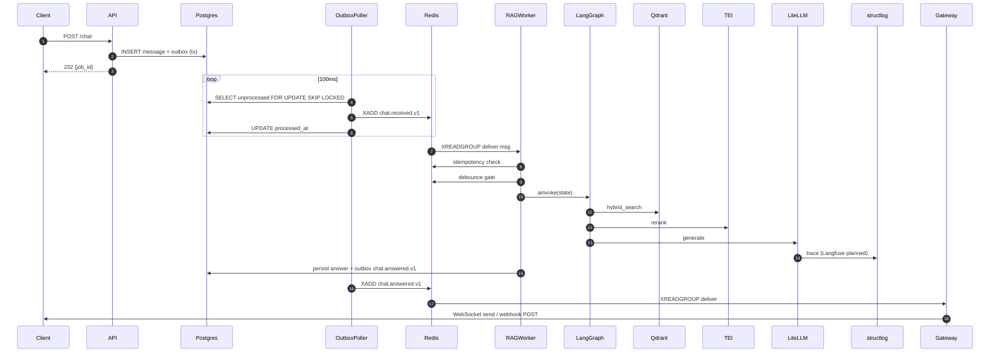

# PHẦN F — PYTHON BUILD SPEC

## 24. Tech Stack khóa cứng

### 24.1 Runtime & Core

| Component | Version | Note |
|---|---|---|
| Python | **3.12+** | structural pattern matching, better async perf |
| asyncio | stdlib | event loop |
| **uvloop** | latest | +2-4x perf |
| **httptools** | latest | +3x HTTP parse |
| pydantic | **2.x** | validation, settings, discriminated union |

### 24.2 Stack per Layer

| Layer | Library | Lý do |
|---|---|---|
| HTTP framework | **FastAPI 0.110+** | async native, OpenAPI auto, Pydantic v2 |
| ASGI server | **uvicorn + uvloop + httptools** | perf tối ưu |
| ORM | **SQLAlchemy 2.0 async + asyncpg** | mature async, type-safe |
| Migration | **Alembic async** | standard |
| Vector store | **Qdrant 1.9+ (gRPC)** | hybrid native dense+sparse, quantization, payload index fast |
| Cache | **Redis Stack 7.x** (RediSearch HNSW + Streams + JSON) | semantic cache + structured cache |
| Message bus | **Redis Streams** (current); NATS JetStream planned as future option | Redis already in stack, sufficient for current scale |
| Task queue | **Taskiq 0.11+** (Redis broker) | async-native |
| LLM orchestration | **LangGraph 0.2+** | StateGraph, async checkpointing |
| LLM proxy | **LiteLLM 1.40+** | unify provider + cost + fallback |
| Embedding server | **Infinity** hoặc **HuggingFace TEI** | BGE-m3 serving, batching |
| Reranker server | **Triton** hoặc **TEI reranker** | BGE-reranker-v2-m3, dynamic batch |
| Structured output | **instructor** | Pydantic enforced LLM output |
| OCR | **Docling** (local) hoặc **Mistral OCR API** | structure-aware |
| Document parsing | **pypdfium2** (stream) + **mammoth** (docx) | không load full RAM |
| Guardrails | **Llama Guard 3** (LiteLLM) + **Lakera** + **Guardrails AI** | layered |
| PII | **Microsoft Presidio** + spaCy vi | redaction |
| Rate limit | **slowapi** + Redis token bucket | per-tenant |
| Auth | **Authlib** + **python-jose** | OAuth2/JWT RS256 |
| DI | **dependency-injector** | lightweight, type-safe |
| Config | **pydantic-settings** + **hvac** (Vault) | env + secrets tách |
| Observability | **structlog** (current) + **OpenTelemetry** + **Prometheus**; Langfuse integration planned | full stack |
| Tracing auto | **opentelemetry-instrumentation-{fastapi,sqlalchemy,httpx}** | auto-instrument |
| Evaluation | **ragas** + **trulens-eval** | CI gate |
| Testing | **pytest-asyncio** + **testcontainers-python** + **hypothesis** + **locust** | full |
| Lint/format | **Ruff** + **mypy strict** | fast & strict |
| Security scan | **bandit** + **semgrep** + **gitleaks** + **trivy** | CI mandatory |
| Dep manager | **uv** | fast than poetry |

### 24.3 Ma trận quyết định

| Quyết định | Chọn | Lý do từ chối alternatives |
|---|---|---|
| Message bus | Redis Streams (current) | Kafka overkill + ops tốn; RabbitMQ thêm dep; Redis already in stack. NATS JetStream = future option for higher scale |
| Task queue | Taskiq | Celery sync legacy; Arq chỉ Redis; Dramatiq sync; Taskiq = async-native |
| Vector store | Qdrant | pgvector không hybrid native; weaviate ops phức tạp; pinecone cloud-only |
| Embedding server | Infinity/TEI | sentence-transformers trong process → block loop; TEI batching tốt |
| Reranker | BGE local | Cohere SaaS đắt + PII VN rời máy chủ; BGE-reranker-v2-m3 free + VN tốt |
| Orchestration | LangGraph | LlamaIndex Workflow không checkpointer; Temporal overkill; tự build mất checkpoint |
| Structured output | instructor | function calling raw fail schema; instructor retry với reminder |
| LLM gateway | LiteLLM | OpenAI SDK không multi-provider; LangChain wrapper không cost tốt |
| Cache | Redis Stack | Memcached không vector search; KeyDB maintenance thấp |
| DI | dependency-injector | FastAPI Depends không đủ cho workers; punq quá đơn giản |

---

## 25. Project Layout (Hexagonal Strict)

### 25.1 Folder Tree đầy đủ

```
ragbot/
├── pyproject.toml                 # deps exact version
├── uv.lock
├── Dockerfile                     # multi-stage
├── docker-compose.yml             # local dev full stack
├── .env.example
├── alembic.ini
├── alembic/
│   ├── env.py                     # async config
│   └── versions/
├── helm/                          # PLANNED — not yet implemented (Docker Compose only)
│   ├── Chart.yaml
│   ├── values.yaml
│   └── templates/
│                                  # (CI/CD — REMOVED 2026-04-23; project
│                                  #  runs local only via deploy.sh +
│                                  #  docker-compose. No GitHub Actions.)
├── tests/
│   ├── unit/                      # domain + application, no IO
│   ├── integration/               # testcontainers
│   ├── e2e/                       # httpx client
│   ├── eval/                      # RAGAS regression gate
│   ├── load/                      # locust
│   └── conftest.py
├── golden_set/                    # Git LFS
│   ├── factoid.jsonl
│   ├── multi_hop.jsonl
│   ├── aggregation.jsonl
│   ├── conflict.jsonl
│   ├── outdated.jsonl
│   ├── out_of_scope.jsonl
│   ├── adversarial.jsonl
│   ├── injection.jsonl
│   ├── mixed_lang.jsonl
│   ├── rare.jsonl
│   ├── ambiguous.jsonl
│   ├── no_answer.jsonl
│   └── baseline_metrics.json
├── docs/
│   ├── adr/                       # architecture decision records
│   ├── runbook.md
│   └── api.md
└── src/ragbot/
    ├── __init__.py
    ├── bootstrap.py               # DI container wiring
    ├── config.py                  # pydantic-settings
    │
    ├── domain/                    # PURE Python, zero framework
    │   ├── shared/
    │   │   ├── value_objects.py   # TenantId, BotId, ConversationId (NewType)
    │   │   ├── events.py          # DomainEvent base + all events
    │   │   ├── errors.py          # DomainError hierarchy
    │   │   └── types.py
    │   ├── tenancy/
    │   │   ├── tenant.py
    │   │   ├── bot.py
    │   │   └── quota.py
    │   ├── conversation/
    │   │   ├── conversation.py
    │   │   ├── message.py
    │   │   └── summary.py
    │   ├── document/
    │   │   ├── document.py
    │   │   ├── chunk.py
    │   │   ├── block.py
    │   │   └── document_profile.py
    │   ├── chunking/
    │   │   ├── strategy.py        # Protocol
    │   │   └── chunk_metadata.py
    │   ├── retrieval/
    │   │   ├── candidate.py
    │   │   └── query.py
    │   └── citation/
    │       ├── citation.py
    │       └── validator.py
    │
    ├── application/
    │   ├── ports/                 # Protocols
    │   │   ├── llm_port.py
    │   │   ├── embedding_port.py
    │   │   ├── reranker_port.py
    │   │   ├── vector_port.py
    │   │   ├── cache_port.py
    │   │   ├── bus_port.py
    │   │   ├── moderation_port.py
    │   │   ├── pii_port.py
    │   │   ├── ocr_port.py
    │   │   ├── guardrail_port.py
    │   │   ├── tool_port.py
    │   │   └── document_repository_port.py
    │   ├── use_cases/
    │   │   ├── ingest_document.py
    │   │   ├── answer_question.py
    │   │   ├── give_feedback.py
    │   │   ├── reindex_corpus.py
    │   │   └── update_bot_config.py
    │   ├── queries/               # CQRS read
    │   │   ├── get_conversation_history.py
    │   │   ├── list_documents.py
    │   │   └── get_trace.py
    │   ├── policies/
    │   │   ├── rate_limit_policy.py
    │   │   ├── token_budget_policy.py
    │   │   ├── tenant_isolation_policy.py
    │   │   └── freshness_policy.py
    │   ├── sagas/                 # LangGraph StateGraph
    │   │   ├── rag_graph.py
    │   │   ├── ingest_graph.py
    │   │   └── graph_state.py     # TypedDict schemas
    │   └── services/              # application orchestration
    │       ├── prompt_assembler.py
    │       ├── citation_binder.py
    │       └── conversation_summarizer.py
    │
    ├── infrastructure/            # adapters
    │   ├── persistence/
    │   │   ├── sqlalchemy/
    │   │   │   ├── models.py
    │   │   │   ├── repositories/
    │   │   │   │   ├── conversation_repo.py
    │   │   │   │   ├── document_repo.py
    │   │   │   │   ├── bot_repo.py
    │   │   │   │   └── outbox_repo.py
    │   │   │   ├── unit_of_work.py
    │   │   │   └── session.py
    │   │   └── row_level_security.sql
    │   ├── vector/
    │   │   └── qdrant_adapter.py
    │   ├── cache/
    │   │   ├── redis_semantic_cache.py
    │   │   ├── redis_embedding_cache.py
    │   │   ├── redis_response_cache.py
    │   │   └── redis_chunks_cache.py
    │   ├── bus/
    │   │   ├── redis_streams_adapter.py  # message bus via Redis Streams
    │   │   ├── outbox_poller.py
    │   │   └── dlq_consumer.py
    │   ├── llm/
    │   │   ├── litellm_adapter.py
    │   │   └── prompt_templates/
    │   │       ├── system.jinja
    │   │       ├── contextual_retrieval.jinja
    │   │       ├── router.jinja
    │   │       ├── hyde.jinja
    │   │       ├── grader.jinja
    │   │       ├── rewriter.jinja
    │   │       └── reflect.jinja
    │   ├── embedding/
    │   │   ├── infinity_adapter.py
    │   │   └── late_chunking.py
    │   ├── reranker/
    │   │   ├── bge_reranker_adapter.py
    │   │   └── cohere_adapter.py   # fallback
    │   ├── ocr/
    │   │   ├── docling_adapter.py
    │   │   └── mistral_adapter.py
    │   ├── chunking/
    │   │   ├── block_detector.py
    │   │   ├── feature_extractor.py
    │   │   ├── strategy_selector.py
    │   │   ├── cross_checker.py
    │   │   ├── hdt_executor.py
    │   │   ├── semantic_executor.py
    │   │   ├── proposition_executor.py
    │   │   ├── hybrid_executor.py
    │   │   └── narrator.py
    │   ├── guardrails/
    │   │   ├── llama_guard_adapter.py
    │   │   ├── lakera_adapter.py
    │   │   ├── prompt_injection_detector.py
    │   │   └── canary_token.py
    │   ├── pii/
    │   │   └── presidio_adapter.py
    │   ├── tools/
    │   │   ├── webhook_tool.py
    │   │   ├── email_tool.py
    │   │   ├── sql_tool.py
    │   │   └── websearch_tool.py
    │   └── observability/
    │       ├── langfuse_tracer.py     # PLANNED — stub only
    │       ├── otel_setup.py
    │       ├── prometheus_metrics.py
    │       └── structlog_setup.py
    │
    └── interfaces/
        ├── http/
        │   ├── app.py             # FastAPI instance
        │   ├── lifespan.py        # startup/shutdown
        │   ├── deps.py            # Depends factory
        │   ├── middleware/
        │   │   ├── tenant_context.py
        │   │   ├── rate_limit.py
        │   │   ├── logging.py
        │   │   ├── cost_tracking.py
        │   │   └── trace_context.py
        │   ├── routers/
        │   │   ├── chat.py
        │   │   ├── documents.py
        │   │   ├── bots.py
        │   │   ├── feedback.py
        │   │   ├── conversations.py
        │   │   └── health.py
        │   ├── dto/
        │   └── errors.py
        ├── ws/
        │   ├── chat_ws.py
        │   └── connection_manager.py
        ├── webhooks/
        │   ├── zalo_adapter.py
        │   ├── telegram_adapter.py
        │   ├── messenger_adapter.py
        │   └── generic_adapter.py
        └── workers/
            ├── ingest_worker.py
            ├── rag_worker.py
            ├── feedback_worker.py
            ├── reindex_worker.py
            └── outbox_worker.py
```

### 25.2 Import Rules

```
interfaces/  →  application/  →  domain/
     ↓              ↓              ↑
infrastructure/  ────────→  domain/ (implements ports)
```

**Luật vàng**:
- `domain/` import **ZERO** external packages (chỉ stdlib).
- `application/` import `domain/` + stdlib.
- `infrastructure/` import `application/ports` (implement) + `domain/`.
- `interfaces/` import `application/use_cases` qua DI + `infrastructure/` setup.
- **Import ngược** (domain import FastAPI/SQLAlchemy) → **CI fail** (import-linter config).

### 25.3 Bootstrap & DI

```python
# src/ragbot/bootstrap.py (pattern pseudocode)
from dependency_injector import containers, providers

class Container(containers.DeclarativeContainer):
    config = providers.Configuration(pydantic_settings=[Settings()])

    # Infrastructure singletons
    db_engine = providers.Singleton(create_async_engine, url=config.db.url, ...)
    redis_client = providers.Singleton(Redis.from_url, url=config.redis.url)
    redis_streams = providers.Singleton(Redis.from_url, url=config.redis.url)  # message bus
    qdrant_client = providers.Singleton(AsyncQdrantClient, url=config.qdrant.url)
    litellm_router = providers.Singleton(Router, model_list=config.llm.models)

    # Adapters (implement ports)
    vector_adapter = providers.Factory(QdrantAdapter, client=qdrant_client)
    cache_semantic = providers.Factory(RedisSemanticCache, redis=redis_client)
    # ...

    # Use cases
    answer_question_uc = providers.Factory(
        AnswerQuestionUseCase,
        llm=llm_adapter,
        vector=vector_adapter,
        cache=cache_semantic,
        # ...
    )
```

Wired 1 lần startup, inject qua `Depends(Provide[Container.answer_question_uc])`.

---

## 26. Domain Layer code pattern

### 26.1 Value Objects (type-safe ID)

```python
from typing import NewType
from uuid import UUID

TenantId = NewType("TenantId", UUID)
BotId = NewType("BotId", UUID)
ConversationId = NewType("ConversationId", UUID)
DocumentId = NewType("DocumentId", UUID)
ChunkId = NewType("ChunkId", UUID)
UserId = NewType("UserId", str)
MessageId = NewType("MessageId", UUID)
```

Value objects phức tạp dùng **frozen**:

```python
@dataclass(frozen=True, slots=True)
class ContentHash:
    value: str  # SHA256 hex
    def __post_init__(self):
        if len(self.value) != 64:
            raise ValueError("SHA256 must be 64 hex chars")
```

- `ContentHash` — SHA256 hex.
- `Embedding` — tuple[float, ...] + model_version.
- `NormalizedQuery` — text + language + intent.
- `StructuralPath` — tuple[str, ...].
- `ValidityWindow` — valid_from, valid_until.
- `AuthorityScore` — float 0-1 với validation.

### 26.2 Aggregates

- `Tenant` — quota, config.
- `Bot` — system_prompt, pipeline_config, output_mappings, ai_tools_enabled.
- `Conversation` — messages, summary, turn_count.
- `Document` — chunks, version_history, lifecycle_state.

Quy tắc aggregate:
- Invariant enforced trong aggregate.
- Cross-aggregate reference bằng **ID only**.
- Load full từ repository (không partial).

### 26.3 Domain Events

```python
@dataclass(frozen=True, kw_only=True, slots=True)
class DomainEvent:
    event_id: UUID
    occurred_at: datetime
    tenant_id: TenantId
    trace_id: str
    version: str = "v1"
```

Events:
- `DocumentUploaded`, `DocumentIngested`, `DocumentFailed`, `DocumentArchived`.
- `ChatReceived`, `ChatAnswered`, `ChatFailed`, `ChatDeliveryFailed`.
- `CorpusVersionBumped`.
- `BotConfigUpdated`.
- `FeedbackGiven`.
- `QuotaExceeded`.
- `SecurityIncident`.

### 26.4 Error Hierarchy

```python
class DomainError(Exception): ...
class TenantIsolationViolation(DomainError): ...     # critical, log + alert
class CitationHallucinated(DomainError): ...
class QuotaExceeded(DomainError): ...
class InvalidDocumentState(DomainError): ...
class ModerationRejected(DomainError): ...
class PromptInjectionDetected(DomainError): ...
```

Map HTTP chỉ ở `interfaces/http/errors.py`.

---

## 27. Application Layer code pattern

### 27.1 Ports (Protocols)

```python
from typing import Protocol, runtime_checkable

class LLMPort(Protocol):
    async def complete(
        self,
        prompt: str,
        *,
        model: str,
        temperature: float = 0.0,
        max_tokens: int = 1000,
        response_schema: type[BaseModel] | None = None,
        tenant_id: TenantId,
        trace_metadata: dict[str, Any],
    ) -> LLMResponse: ...

    async def stream(self, ...) -> AsyncIterator[str]: ...

class VectorStorePort(Protocol):
    async def hybrid_search(
        self, query: HybridQuery, *, tenant_id: TenantId, limit: int
    ) -> list[Candidate]: ...
    async def upsert(self, chunks: list[Chunk], *, tenant_id: TenantId) -> None: ...
    async def delete_by_doc(self, doc_id: DocumentId, *, tenant_id: TenantId) -> int: ...
```

**Quy tắc**: mọi port có `tenant_id` kwarg mandatory (không default None) — enforce ở type level.

### 27.2 Use Cases (skeleton)

```python
class AnswerQuestionUseCase:
    def __init__(
        self,
        rag_graph: CompiledGraph,
        moderation: ModerationPort,
        cache: SemanticCachePort,
        bus: EventBusPort,
        conv_repo: ConversationRepositoryPort,
        uow: UnitOfWorkPort,
        budget_policy: TokenBudgetPolicy,
        logger: structlog.BoundLogger,  # Langfuse tracer planned
    ): ...

    async def execute(self, cmd: AnswerQuestionCommand) -> AnswerQuestionResult:
        # 1. Budget check
        await self._budget_policy.ensure_affordable(cmd.tenant_id, estimated_tokens=5000)

        # 2. Semantic cache lookup
        if cached := await self._cache.find_similar(
            cmd.query, cmd.tenant_id, cmd.bot_id, cmd.corpus_version, threshold=0.97
        ):
            return AnswerQuestionResult.from_cache(cached)

        # 3. Persist user message + outbox (atomic)
        async with self._uow:
            conversation = await self._conv_repo.get_or_create(
                cmd.bot_id, cmd.sender_id, tenant_id=cmd.tenant_id
            )
            conversation.add_user_message(cmd.content)
            await self._conv_repo.save(conversation)
            await self._uow.add_outbox(ChatReceived(...))
            await self._uow.commit()

        # 4. Return 202 + job_id; RAG happens in worker
        return AnswerQuestionResult.accepted(job_id=conversation.last_message_id)
```

**RAG graph execution ở worker**, KHÔNG ở HTTP handler.

### 27.3 Queries (CQRS read side)

Tách khỏi use case. Trả DTO trực tiếp:

```python
class GetConversationHistoryQuery:
    async def execute(
        self,
        conv_id: ConversationId,
        tenant_id: TenantId,
        limit: int = 20,
    ) -> list[MessageDTO]:
        # Select với eager load, trả DTO
        ...
```

Dùng **materialized view** cho analytics (daily stats, dashboard).

### 27.4 Policies

Pure function, input → decision:

```python
class TokenBudgetPolicy:
    def __init__(self, quota_repo: QuotaRepositoryPort):
        self._quota_repo = quota_repo

    async def ensure_affordable(
        self, tenant_id: TenantId, estimated_tokens: int
    ) -> None:
        quota = await self._quota_repo.get(tenant_id)
        if quota.used + estimated_tokens > quota.monthly_limit:
            raise QuotaExceeded(tenant_id=tenant_id, ...)
        if quota.used > quota.monthly_limit * 0.8:
            logger.warning("budget_soft_warn", tenant=tenant_id, usage=quota.ratio)
```

---

## 28. Infrastructure Layer code pattern

### 28.1 Persistence (SQLAlchemy 2.0 async)

```python
# infrastructure/persistence/sqlalchemy/session.py
engine = create_async_engine(
    settings.db.url,
    pool_size=20,
    max_overflow=10,
    pool_recycle=1800,
    pool_pre_ping=True,
    echo=False,
)
AsyncSessionLocal = async_sessionmaker(engine, expire_on_commit=False)
```

**Row-Level Security Postgres**:
```sql
ALTER TABLE conversations ENABLE ROW LEVEL SECURITY;
CREATE POLICY tenant_isolation ON conversations
    USING (tenant_id = current_setting('app.tenant_id')::uuid);
```

Middleware set session variable:
```python
async with session.begin():
    await session.execute(text("SET LOCAL app.tenant_id = :t"), {"t": tenant_id})
    # queries automatically filtered
```

**Repository base** enforce tenant filter:
```python
class TenantScopedRepository(ABC):
    def __init__(self, session: AsyncSession, tenant_id: TenantId):
        if not tenant_id:
            raise TenantIsolationViolation("tenant_id missing")
        self._session = session
        self._tenant_id = tenant_id
```

**Unit of Work + Outbox**:
```python
class SqlAlchemyUnitOfWork:
    async def __aenter__(self):
        self._session = AsyncSessionLocal()
        return self
    async def commit(self):
        await self._session.commit()
    async def add_outbox(self, event: DomainEvent):
        self._session.add(OutboxRow.from_event(event))
```

### 28.2 Vector (Qdrant)

Collection setup:
```python
await client.create_collection(
    collection_name="ragbot",
    vectors_config={
        "dense": VectorParams(
            size=1024,
            distance=Distance.COSINE,
            hnsw_config=HnswConfigDiff(m=32, ef_construct=256, on_disk=True),
            quantization_config=ScalarQuantization(
                scalar=ScalarQuantizationConfig(type=ScalarType.INT8, always_ram=True)
            ),
        ),
    },
    sparse_vectors_config={"sparse": SparseVectorParams()},
    on_disk_payload=True,
    optimizers_config=OptimizersConfigDiff(default_segment_number=5),
)
# Payload indexes (mandatory)
await client.create_payload_index("ragbot", "tenant_id", PayloadSchemaType.KEYWORD)
await client.create_payload_index("ragbot", "corpus_version", PayloadSchemaType.KEYWORD)
await client.create_payload_index("ragbot", "embedding_model_version", PayloadSchemaType.KEYWORD)
await client.create_payload_index("ragbot", "valid_until", PayloadSchemaType.DATETIME)
await client.create_payload_index("ragbot", "language", PayloadSchemaType.KEYWORD)
```

Hybrid search với RRF:
```python
results = await client.query_points(
    collection_name="ragbot",
    prefetch=[
        Prefetch(query=dense_vec, using="dense", limit=100),
        Prefetch(query=sparse_vec, using="sparse", limit=100),
    ],
    query=FusionQuery(fusion=Fusion.RRF),
    query_filter=Filter(must=[
        FieldCondition(key="tenant_id", match=MatchValue(value=str(tenant_id))),
        FieldCondition(key="corpus_version", match=MatchValue(value=cv)),
        FieldCondition(key="embedding_model_version", match=MatchValue(value=emv)),
        FieldCondition(key="valid_until", range=Range(gte=now_iso)),
    ]),
    limit=50,
)
```

### 28.3 Cache (2-tier: exact hash Redis + semantic pgvector)

```python
# Key generators
def semantic_cache_key(tenant_id, bot_version, corpus_version) -> str:
    return f"sc:t:{tenant_id}:bv:{bot_version}:cv:{corpus_version}"

def embedding_cache_key(model_version, text_hash) -> str:
    return f"emb:mv:{model_version}:h:{text_hash}"
```

**Semantic cache với RediSearch HNSW**:
```python
# Create index once
await redis.ft("sc_idx").create_index(
    fields=[
        VectorField("embedding", "HNSW", {"TYPE": "FLOAT32", "DIM": 1024, "DISTANCE_METRIC": "COSINE"}),
        TagField("tenant_id"), TagField("bot_version"), TagField("corpus_version"),
    ],
    definition=IndexDefinition(prefix=["sc:"], index_type=IndexType.HASH),
)

# Search
query = Query("(@tenant_id:{...} @bot_version:{...} @corpus_version:{...})=>[KNN 1 @embedding $vec AS score]") \
    .return_fields("response", "score").dialect(2)
result = await redis.ft("sc_idx").search(query, query_params={"vec": query_embedding.tobytes()})
if result.docs and float(result.docs[0].score) <= 0.03:
    return json.loads(result.docs[0].response)
```

### 28.4 Bus (Redis Streams + Outbox Poller)

```python
class OutboxPoller:
    async def run(self):
        while not self._stop:
            async with self._session_factory() as session:
                rows = await session.scalars(
                    select(OutboxRow)
                    .where(OutboxRow.processed_at.is_(None))
                    .order_by(OutboxRow.created_at)
                    .limit(100)
                    .with_for_update(skip_locked=True)
                )
                for row in rows:
                    try:
                        await self._redis.xadd(
                            row.subject,
                            {"payload": row.payload, "msg-id": str(row.id), "trace-id": row.trace_id}
                        )
                        row.processed_at = datetime.utcnow()
                    except Exception as e:
                        row.retry_count += 1
                        if row.retry_count > 5:
                            row.status = "dlq"
                await session.commit()
            await asyncio.sleep(0.1)
```

**Idempotency**:
```python
async def is_duplicate(msg_id: str) -> bool:
    key = f"idem:{msg_id}"
    set_result = await redis.set(key, "1", nx=True, ex=86400)
    return set_result is None
```

### 28.5 LLM (LiteLLM)

```python
from litellm import Router

router = Router(
    model_list=[
        {"model_name": "router-lite", "litellm_params": {"model": "gpt-4o-mini", "api_key": "..."}},
        {"model_name": "generator", "litellm_params": {"model": "gpt-4o", "api_key": "..."}},
        {"model_name": "fallback-local", "litellm_params": {"model": "openai/qwen2.5-72b", "api_base": "http://vllm:8000/v1"}},
    ],
    fallbacks=[{"generator": ["fallback-local"]}],
    set_verbose=False,
    retry_policy=RetryPolicy(num_retries=2, retry_after=1),
)
```

Callback cost tracking:
```python
litellm.success_callback = [CostTrackingCallback(db=pg)]  # Langfuse callback planned
```

### 28.6 Embedding (Infinity + DataLoader)

```python
class InfinityEmbedder:
    async def embed_batch(self, texts: list[str]) -> list[Embedding]:
        async with self._semaphore:
            resp = await self._http.post(
                f"{self._url}/embeddings",
                json={"model": "BAAI/bge-m3", "input": texts}
            )
            return [Embedding(data=d["embedding"], model_version="bge-m3-v1")
                    for d in resp.json()["data"]]

class EmbeddingDataLoader:
    def __init__(self, embedder, max_batch=64, wait_ms=10):
        self._queue = asyncio.Queue()
        asyncio.create_task(self._worker())

    async def load(self, text: str) -> Embedding:
        future = asyncio.get_event_loop().create_future()
        await self._queue.put((text, future))
        return await future

    async def _worker(self):
        while True:
            batch = []
            try:
                first = await asyncio.wait_for(self._queue.get(), timeout=self._wait_ms/1000)
                batch.append(first)
                while len(batch) < self._max_batch:
                    try:
                        batch.append(self._queue.get_nowait())
                    except asyncio.QueueEmpty:
                        break
                texts = [b[0] for b in batch]
                embs = await self._embedder.embed_batch(texts)
                for (_, fut), emb in zip(batch, embs):
                    fut.set_result(emb)
            except asyncio.TimeoutError:
                pass
```

**Late Chunking**:
```python
async def late_chunk_embed(doc_text: str, boundaries: list[tuple[int, int]]) -> list[Embedding]:
    token_embs = await infinity.encode_tokens(doc_text)  # [n_tokens, dim]
    chunk_embs = []
    for start, end in boundaries:
        chunk_embs.append(mean_pool(token_embs[start:end]))
    return chunk_embs
```

### 28.7 Reranker (BGE via TEI)

```python
class BGERerankerAdapter:
    async def rerank(self, query: str, passages: list[str]) -> list[float]:
        async with self._breaker:
            resp = await self._http.post(
                f"{self._url}/rerank",
                json={"query": query, "texts": passages, "truncate": True}
            )
            return [r["score"] for r in resp.json()]
```

Circuit breaker (pybreaker):
```python
breaker = CircuitBreaker(fail_max=5, reset_timeout=30)

@breaker
async def rerank_call(...): ...

try:
    scores = await rerank_call(...)
except CircuitBreakerError:
    logger.error("reranker_open_circuit")
    metric_reranker_fallback.inc()
    scores = [c.dense_score for c in candidates]  # fallback
```

### 28.8 OCR (Docling)

```python
class DoclingAdapter:
    async def parse(self, file_bytes: bytes) -> ParsedDocument:
        loop = asyncio.get_event_loop()
        result = await loop.run_in_executor(
            self._executor, self._docling.convert, io.BytesIO(file_bytes)
        )
        return ParsedDocument.from_docling(result)
```

Stream PDF cho file lớn:
```python
import pypdfium2 as pdfium

async def stream_pages(file_path: Path) -> AsyncIterator[Page]:
    pdf = pdfium.PdfDocument(file_path)
    for i in range(len(pdf)):
        page = pdf[i]
        yield Page(index=i, text=page.get_textpage().get_text_range())
        page.close()
    pdf.close()
```

### 28.9 Guardrails

**Llama Guard 3 qua LiteLLM**:
```python
async def check_input_safe(text: str) -> ModerationResult:
    resp = await llm.complete(
        f"Classify: {text}",
        model="llama-guard-3",
        response_schema=ModerationResult,
    )
    return resp
```

**Prompt injection detector**:
```python
INJECTION_PATTERNS = [
    r"ignore\s+(previous|above)\s+instructions",
    r"you\s+are\s+now\s+(a|an)",
    r"system\s*:",
]
def detect_injection(text: str) -> bool:
    return any(re.search(p, text, re.I) for p in INJECTION_PATTERNS)
```

**Canary token**:
```python
CANARY = secrets.token_urlsafe(16)
system_prompt = f"{base_prompt}\nINTERNAL-CANARY-{CANARY}"

async def check_canary_in_output(output: str, state: RAGState):
    if CANARY in output:
        metric_canary_leak.inc()
        logger.critical("canary_leak", tenant=state["tenant_id"])
        await bus.publish(SecurityIncident(type="canary_leak", severity="critical"))
        await alert_oncall()
        raise PromptInjectionDetected("canary leaked")
```

### 28.10 Observability

**Observability** (structlog current, Langfuse planned):
```python
# CURRENT: structlog-based tracing
import structlog
logger = structlog.get_logger()

async def generate_answer(...):
    logger.info("answer_question",
        user_id=state.sender_id,
        session_id=state.conversation_id,
        tenant_id=state.tenant_id,
        route=state.route,
        iter=state.iter,
    )
    ...
```

**OpenTelemetry auto-instrumentation**:
```python
from opentelemetry.instrumentation.fastapi import FastAPIInstrumentor
from opentelemetry.instrumentation.sqlalchemy import SQLAlchemyInstrumentor
from opentelemetry.instrumentation.httpx import HTTPXClientInstrumentor

FastAPIInstrumentor.instrument_app(app)
SQLAlchemyInstrumentor().instrument(engine=engine.sync_engine)
HTTPXClientInstrumentor().instrument()
```

**Prometheus metrics**:
```python
from prometheus_client import Counter, Histogram, Gauge

rag_stage_latency = Histogram("rag_stage_latency_seconds", "", ["stage", "route"],
    buckets=[0.05, 0.1, 0.2, 0.5, 1, 2, 5, 10])
rag_tokens = Counter("rag_tokens_total", "", ["provider", "model", "kind", "tenant_id"])
rag_cost_usd = Counter("rag_cost_usd_total", "", ["tenant_id", "bot_id"])
cache_hit = Counter("cache_hit_total", "", ["layer", "tenant_id"])
retrieval_recall = Gauge("retrieval_recall_at_5", "", ["tenant_id"])
reranker_circuit_state = Gauge("reranker_circuit_state", "0=closed,1=open,2=half")
iteration_count = Histogram("reasoning_iteration_count", "", buckets=[1,2,3,4,5])
canary_leak = Counter("canary_leak_total", "")
```

**structlog + contextvars**:
```python
import structlog
from contextvars import ContextVar

trace_ctx = ContextVar("trace_id", default="")
tenant_ctx = ContextVar("tenant_id", default="")

structlog.configure(
    processors=[
        structlog.contextvars.merge_contextvars,
        structlog.processors.TimeStamper(fmt="iso"),
        structlog.processors.add_log_level,
        structlog.processors.StackInfoRenderer(),
        structlog.processors.format_exc_info,
        structlog.processors.JSONRenderer(),
    ],
)

async def logging_middleware(request, call_next):
    trace_id = request.headers.get("traceparent", str(uuid4()))
    structlog.contextvars.bind_contextvars(
        trace_id=trace_id,
        tenant_id=request.state.tenant_id,
        path=request.url.path,
    )
    ...
```

**Trace propagate qua Redis Streams**:
```python
async def publish_with_trace(subject: str, payload: bytes):
    carrier = {}
    inject(carrier)
    fields = {"payload": payload, "trace-id": str(trace.get_current_span().get_span_context().trace_id)}
    fields.update({f"otel-{k}": v for k, v in carrier.items()})
    await redis.xadd(subject, fields)

async def handle_with_trace(msg: dict):
    carrier = {k.replace("otel-", ""): v for k, v in msg.items() if k.startswith("otel-")}
    ctx = extract(carrier)
    with tracer.start_as_current_span("handle", context=ctx):
        ...
```

---

## 29. Interfaces Layer

### 29.1 HTTP (FastAPI)

```python
@asynccontextmanager
async def lifespan(app: FastAPI):
    container = Container()
    await container.init_resources()
    app.state.container = container
    # Warmup
    await container.embedder().embed_batch(["warmup"])
    yield
    await container.shutdown_resources()

app = FastAPI(lifespan=lifespan, default_response_class=ORJSONResponse)
app.add_middleware(GZipMiddleware, minimum_size=1000)
app.add_middleware(TenantContextMiddleware)
app.add_middleware(RateLimitMiddleware)
app.add_middleware(LoggingMiddleware)
app.add_middleware(TraceContextMiddleware)
```

**202 Accepted pattern**:
```python
@router.post("/chat", status_code=202)
async def chat(
    req: ChatRequest,
    uc: AnswerQuestionUseCase = Depends(Provide[Container.answer_question_uc]),
    tenant_id: TenantId = Depends(get_tenant_id),
) -> ChatAccepted:
    cmd = AnswerQuestionCommand(
        tenant_id=tenant_id,
        bot_id=req.bot_id,
        sender_id=req.sender_id,
        content=req.content,
        channel=req.channel,
    )
    result = await uc.execute(cmd)
    return ChatAccepted(job_id=result.job_id, status_url=f"/chat/{result.job_id}")
```

**Tenant context middleware**:
```python
class TenantContextMiddleware:
    async def __call__(self, request: Request, call_next):
        token = request.headers.get("Authorization", "").replace("Bearer ", "")
        try:
            payload = jwt.decode(token, settings.jwt.public_key, algorithms=["RS256"])
            request.state.tenant_id = TenantId(UUID(payload["tenant_id"]))
            request.state.user_id = payload["sub"]
        except Exception:
            return JSONResponse({"error": "unauthorized"}, 401)
        tenant_ctx.set(str(request.state.tenant_id))
        return await call_next(request)
```

### 29.2 WebSocket

```python
@router.websocket("/ws/chat")
async def chat_ws(ws: WebSocket, manager: ConnectionManager = Depends(...)):
    await ws.accept()
    conv_id = await authenticate_ws(ws)
    await manager.connect(conv_id, ws)
    try:
        # Listen for answers on Redis Stream for this conversation
        last_id = "$"
        while True:
            msgs = await redis.xread({f"conv.{conv_id}.answer": last_id}, block=5000)
            for stream, entries in msgs:
                for entry_id, data in entries:
                    await ws.send_json(data)
                    last_id = entry_id
    finally:
        await manager.disconnect(conv_id, ws)
```

### 29.3 Webhook adapters

```python
@router.post("/webhooks/zalo")
async def zalo_webhook(
    payload: ZaloEvent,
    sig: str = Header(..., alias="X-ZEvent-Signature"),
):
    verify_hmac(payload, sig, settings.zalo.secret)
    cmd = translate_zalo_to_cmd(payload)
    await chat_uc.execute(cmd)  # 202, actual work in worker
    return {"ok": True}

async def post_to_zalo(answer: ChatAnswered):
    await http.post(
        "https://openapi.zalo.me/v2.0/oa/message",
        headers={"access_token": tenant.zalo_token},
        json={"recipient": {"user_id": answer.sender_id}, "message": {"text": answer.text}},
    )
```

### 29.4 Taskiq Workers

```python
broker = RedisBroker("redis://redis:6379")  # Redis Streams as message transport

@broker.task(
    task_name="chat.received.v1",
    retry_on_error=True,
    max_retries=3,
)
async def handle_chat_received(payload: dict):
    event = ChatReceived(**payload)
    if await is_duplicate(event.event_id):
        return
    if not await debounce_gate(event.bot_id, event.sender_id, wait_ms=800):
        return
    uc = container.rag_execute_uc()
    await uc.execute(event)
```

---

## 30. Event-Driven Flow end-to-end

### 30.1 Request Lifecycle (Mermaid sequence)



### 30.2 Compensation (Saga)

Khi push-to-client fail sau khi answer persisted:
```python
@broker.task(task_name="chat.answered.delivery")
async def deliver(payload):
    try:
        await push_to_channel(payload)
    except DeliveryError:
        # Compensate: mark as "delivery_failed", don't delete answer
        await uow.execute(
            UpdateMessageStatus(msg_id=payload.msg_id, status="delivery_failed")
        )
        await bus.publish(ChatDeliveryFailed(...))
        raise  # Taskiq retry with backoff
```

### 30.3 DLQ Replay

```python
@broker.task(task_name="dlq.chat.received.v1")
async def dlq_handler(payload: dict, error: str):
    await alert_team(payload, error)
    await save_to_s3_for_replay(payload)

async def replay_dlq(subject: str, since: datetime):
    # read from S3, re-publish to original subject
    ...
```

---

## 31. Testing Strategy

### 31.1 Unit

```python
def test_conversation_merge_consecutive_user_messages():
    conv = Conversation.new(tenant_id, bot_id, sender_id)
    conv.add_user_message("Bao giờ")
    conv.add_user_message("Giao ngay")
    merged = conv.history_for_llm()
    assert len(merged) == 1
    assert "Bao giờ\nGiao ngay" in merged[0].content
```

### 31.2 Integration (testcontainers)

```python
@pytest.fixture(scope="session")
async def qdrant():
    with QdrantContainer(version="v1.9.0") as c:
        yield c.get_client_url()

@pytest.fixture(scope="session")
async def postgres():
    with PostgresContainer("postgres:16") as c:
        yield c.get_connection_url()
```

### 31.3 N+1 Auto-detection

```python
# tests/conftest.py
@pytest.fixture
async def query_counter(db_session):
    count = {"n": 0}
    def on_execute(conn, cursor, statement, parameters, context, executemany):
        if statement.strip().upper().startswith("SELECT"):
            count["n"] += 1
    event.listen(db_session.bind.sync_engine, "before_cursor_execute", on_execute)
    yield count
    event.remove(db_session.bind.sync_engine, "before_cursor_execute", on_execute)

async def test_get_conversation_history_no_n_plus_one(client, query_counter):
    await client.get(f"/conversations/{conv_id}/history")
    assert query_counter["n"] <= 3, f"N+1 detected: {query_counter['n']} queries"
```

### 31.4 Cross-tenant isolation test

```python
@pytest.mark.asyncio
async def test_cross_tenant_isolation(client_a, client_b, seed_docs_a, seed_docs_b):
    # Tenant A asks → retrieves only A docs
    resp = await client_a.post("/chat", json={"content": "secret of A"})
    answer = await wait_for_answer(resp.json()["job_id"])
    for cit in answer["citations"]:
        assert cit["doc_id"] in seed_docs_a, "LEAK: got tenant B doc"

    # Tenant B tries to reference A's doc_id
    resp = await client_b.post("/chat", json={"content": f"What does doc {seed_docs_a[0]} say?"})
    answer = await wait_for_answer(resp.json()["job_id"])
    for cit in answer["citations"]:
        assert cit["doc_id"] not in seed_docs_a, "LEAK: B retrieved A doc"

    # Cache check
    keys_a = await redis.keys(f"sc:t:{tenant_a}:*")
    for k in keys_a:
        assert tenant_b not in (await redis.get(k)).decode(), "LEAK in cache"
```

### 31.5 E2E

```python
async def test_chat_flow_end_to_end(client, redis, qdrant, postgres):
    # Upload doc
    resp = await client.post("/documents", files={"file": ...})
    doc_job = resp.json()["job_id"]
    await wait_for_event("document.ingested", doc_id=doc_job, timeout=30)
    # Chat
    resp = await client.post("/chat", json={"bot_id": ..., "content": "..."})
    chat_job = resp.json()["job_id"]
    answer = await wait_for_event("chat.answered", job_id=chat_job, timeout=10)
    assert answer["citations"]
```

### 31.6 Load (locust)

```python
from locust import FastHttpUser, task

class ChatUser(FastHttpUser):
    wait_time = between(1, 3)

    @task
    def chat(self):
        self.client.post("/chat", json={"bot_id": "...", "content": sample()})
```

Target: 500 concurrent, p95 < 5s, p99 < 8s.

### 31.7 RAGAS regression

```python
@pytest.mark.eval
@pytest.mark.asyncio
async def test_ragas_no_regression(rag_graph, golden_set, baseline):
    results = []
    for q in golden_set:
        state = initial_state_from(q)
        final = await rag_graph.ainvoke(state)
        results.append({
            "question": q["query"],
            "answer": final["answer"],
            "contexts": [c["text"] for c in final["reranked"]],
            "ground_truth": q["expected_answer"],
        })
    dataset = Dataset.from_list(results)
    scores = evaluate(dataset, metrics=[faithfulness, answer_relevancy, context_precision, context_recall])
    for metric, current in scores.items():
        base = baseline[metric]
        drop = (base - current) / base
        assert drop < 0.02, f"{metric} regressed {drop:.2%} (threshold 2%)"
```

### 31.8 Coverage Targets

- Domain + application: ≥ 90%.
- Infrastructure: ≥ 70%.
- Total: ≥ 80%.

---

## 32. Deployment

### 32.1 Dockerfile multi-stage

```dockerfile
FROM python:3.12-slim AS builder
RUN pip install uv
WORKDIR /app
COPY pyproject.toml uv.lock ./
RUN uv sync --frozen --no-install-project

FROM python:3.12-slim AS runtime
RUN apt-get update && apt-get install -y --no-install-recommends tini && rm -rf /var/lib/apt/lists/*
WORKDIR /app
COPY --from=builder /app/.venv /app/.venv
COPY src/ ./src/
ENV PATH="/app/.venv/bin:$PATH" PYTHONUNBUFFERED=1
USER nobody
ENTRYPOINT ["tini", "--"]
CMD ["uvicorn", "ragbot.interfaces.http.app:app", "--host", "0.0.0.0", "--loop", "uvloop", "--http", "httptools"]
```

### 32.2 docker-compose local

```yaml
services:
  postgres: ...
  qdrant: image: qdrant/qdrant:v1.9.0
  redis: image: redis/redis-stack:7.4.0
  # NATS not used — Redis Streams handles message bus
  # langfuse: planned, not yet in compose
  infinity: image: michaelf34/infinity:latest
  tei_reranker: image: ghcr.io/huggingface/text-embeddings-inference:cpu-1.5
  api: build: .
```

### 32.3 Helm values (PLANNED — not yet implemented)

> **NOTE**: The project currently uses Docker Compose only. K8s/Helm/KEDA configs below are planned for future scaling.

```yaml
services:
  api:
    replicas: {min: 2, max: 20}
    hpa: {metric: rps, target: 50}
  rag_worker:
    keda:
      triggers:
        - type: redis-streams
          metadata: {stream: "chat.received.v1", lagThreshold: "10"}
    replicas: {min: 2, max: 30}
  reranker_server:
    nodeSelector: {gpu: "a10"}
    replicas: {min: 1, max: 4}
```

### 32.4 KEDA autoscale (PLANNED — not yet implemented)

```yaml
apiVersion: keda.sh/v1alpha1
kind: ScaledObject
spec:
  scaleTargetRef: {name: rag-worker}
  triggers:
  - type: redis-streams
    metadata:
      address: redis:6379
      stream: chat.received.v1
      consumerGroup: rag-worker
      lagCount: "10"
```

---

## 33. CI/CD Pipeline

### 33.1 Pre-commit

```yaml
repos:
  - repo: https://github.com/astral-sh/ruff-pre-commit
    hooks: [{id: ruff}, {id: ruff-format}]
  - repo: https://github.com/pre-commit/mirrors-mypy
    hooks: [{id: mypy, args: [--strict]}]
  - repo: https://github.com/PyCQA/bandit
    hooks: [{id: bandit}]
  - repo: https://github.com/gitleaks/gitleaks
    hooks: [{id: gitleaks}]
```

### 33.2 GitHub Actions

```yaml
jobs:
  lint: {runs: [ruff check, ruff format --check, mypy --strict]}
  test_unit: {runs: [pytest tests/unit]}
  test_integration: {runs: [pytest tests/integration], services: [postgres, qdrant, redis]}
  eval_gate: {runs: [pytest tests/eval -m eval]}
  security: {runs: [bandit, semgrep, trivy image scan]}
  build: {needs: [lint, test_unit, test_integration, eval_gate, security]}
```

### 33.3 Quality Gates

- Coverage < 80% → fail.
- mypy error → fail.
- RAGAS drop > 2% → fail.
- Security finding HIGH → fail.

### 33.4 Blue-green DB migration checklist

1. **Backward-compatible only**: thêm column nullable, không rename/drop 1 release.
2. **Dual-write period**: code ghi cả cột cũ + mới.
3. **Backfill job**: async background fill cột mới.
4. **Read cutover**: deploy code đọc từ cột mới.
5. **Drop old column**: release sau, sau khi tự tin.

```python
def upgrade():
    op.add_column("messages", sa.Column("v2_field", sa.Text, nullable=True))

def downgrade():
    op.drop_column("messages", "v2_field")
```

### 33.5 ArgoCD Canary Rollout (PLANNED — not yet implemented)

```yaml
strategy:
  canary:
    steps:
    - setWeight: 5
    - pause: {duration: 10m}
    - setWeight: 25
    - pause: {duration: 15m}
    - setWeight: 50
    - pause: {duration: 30m}
    - setWeight: 100
```

Metric check: RAGAS faithfulness không drop (tracked via structlog + eval pipeline).

---

## 34. Runbook & DR

### 34.1 Reindex không downtime

1. Bump `embedding_model_version` config.
2. Create new Qdrant collection `ragbot_v2`.
3. Background job: re-embed all docs → upsert `ragbot_v2`.
4. Shadow: traffic thật, so sánh retrieval metrics 24h.
5. Canary: flip 5% → 25% → 50% → 100%.
6. Giữ collection cũ 72h, xóa sau.

### 34.2 Rollback

Feature flag flip (Unleash) — không redeploy.

### 34.3 Incident Response

Playbook từng alert:
- `reranker_circuit_open` → check TEI server, restart, fallback dense.
- `citation_hallucinated_spike` → check prompt template, retrieval quality.
- `cross_tenant_leak_suspected` → block tenant, audit cache, rotate keys.
- `canary_token_leak` → critical; rotate canary + system prompt, audit trace, forensic tenant.

### 34.4 Disaster Recovery

- Postgres: backup 1h → S3, PITR.
- Qdrant: snapshot 6h.
- Redis: RDB hourly (cache chấp nhận mất).
- Redis Streams: persisted via RDB/AOF (same as cache Redis instance).
- RTO 4h, RPO 1h.

### 34.5 Secrets Rotation

```python
@broker.task(cron="0 0 * * 0")  # weekly
async def rotate_api_keys():
    for provider in ["openai", "anthropic", "cohere"]:
        new_key = await provider_admin_api.generate_key()
        await vault.write(f"secret/ragbot/{provider}/key", {"value": new_key, "rotated_at": now})
        # Keep old 24h
        await vault.write(f"secret/ragbot/{provider}/key_old", {...})
```

### 34.6 Hard Negative Mining (weekly)

```python
@broker.task(cron="0 2 * * 0")
async def mine_hard_negatives():
    neg = await feedback_repo.list_negative(since=now - timedelta(days=7))
    pairs = []
    for fb in neg:
        for chunk in fb.retrieved_chunks:
            pairs.append({"query": fb.query, "negative": chunk.text})
    await s3.put_object(
        Bucket="ragbot-training",
        Key=f"hard_negatives/{datetime.utcnow().date()}.jsonl",
        Body="\n".join(json.dumps(p) for p in pairs),
    )
    await alert_ml_team(f"{len(pairs)} hard negatives ready for review")
```

### 34.7 Cost Anomaly Detection

```yaml
groups:
- name: ragbot_cost
  rules:
  - alert: CostPerRequestSpike
    expr: |
      rate(rag_cost_usd_total[5m]) / rate(rag_requests_total[5m])
      > (avg_over_time(rate(rag_cost_usd_total[5m])[7d:1h]) / avg_over_time(rate(rag_requests_total[5m])[7d:1h])) * 3
    for: 10m
  - alert: TenantQuotaBurnRate
    expr: |
      (rag_tokens_total / on(tenant_id) tenant_monthly_quota) > 0.5 and day_of_month() < 15
```

---
