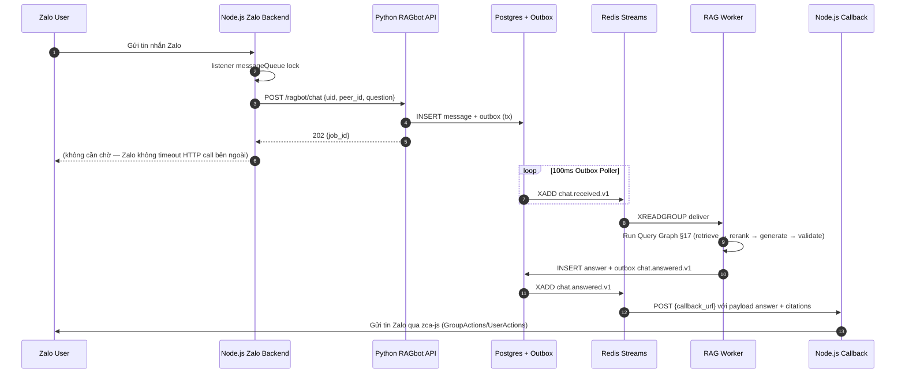

# PHẦN J — CHANNEL INTEGRATION (v1.1)

## 45. Vì sao có Phần J — và mối quan hệ với `ZALO_MASTER.md`

Phần A–I đã đủ để build một **RAGbot service Python độc lập**, nhưng chưa nói rõ **kết nối với channel nào** (Zalo, Telegram, Messenger, Web). Trong dự án thực tế này, service Python RAGbot **không chạy một mình** — nó được gọi từ backend Node.js `uatzalo.workgpt.ai` (chi tiết listener/DAO/socket/audit trong [`ZALO_MASTER.md`](./ZALO_MASTER.md) Chương I–VII).

**Phần J định nghĩa**:
- Contract HTTP chính thức giữa Node.js ↔ Python (4 endpoint, không được break).
- Identifier mapping: Zalo `uid`/`peer_id` ↔ RAGBOT `tenant_id`/`user_id`.
- Event-driven flow: Node.js gửi câu hỏi → Python trả lời về qua callback (không chặn HTTP).
- Template thêm channel mới.

**Không lặp nội dung** đã có ở §5–§41; chỉ nói cách **integrate**.

**Chi tiết thuộc về Zalo** (backend listener, DAO, timeline, cost) → xem [`ZALO_MASTER.md`](./ZALO_MASTER.md).

## 46. Zalo Channel — Contract API (4 endpoint cứng)

Service Python **bắt buộc expose đúng 4 endpoint** dưới đây. Node.js repo đã implement caller tại `src/rest/RestClient.js` (xem [`ZALO_MASTER.md`](./ZALO_MASTER.md) §0–§1 để biết Node.js gọi thế nào):

### 46.1 `POST /ragbot/documents/create`

```json
// Request
{
  "uid": "bot_zalo_uid_string",
  "urlDocument": "https://storage.../file.pdf",
  "document_name": "Báo giá 2025"
}
// Response 202 Accepted
{
  "ok": true,
  "job_id": "job_uuid",
  "tool_name": "bao_gia_2025",
  "status": "queued"
}
```

Side-effect (async trong Ingestion Graph §16):
1. Download file từ `urlDocument` (timeout 60s, retry 3, circuit breaker).
2. OCR fallback nếu PDF scan (Docling / Mistral OCR §28.8).
3. Run Ingestion Graph (AdapChunk §6.5 → Narrate §6.8 → Contextualize §6.9 → Embed §28.6 → Upsert Qdrant §28.2).
4. Register "tool" với `tool_name = slugify(document_name)` vào bot config (để LLM invoke như function nếu cần).
5. Publish event `document.ingested`.

### 46.2 `DELETE /ragbot/documents`

```json
// Request
{ "uid": "...", "toolName": "bao_gia_2025" }
// Response
{ "ok": true, "deleted_chunks": 124 }
```

Xoá tất cả chunk có `payload.bot_uid == uid AND payload.tool_name == toolName` khỏi Qdrant.

Bump `corpus_version` → cache tự invalidate (§14.7).

### 46.3 `POST /ragbot/documents/rechunk`

```json
// Request
{ "bot_id": "...", "documentUrl": "https://..." }
// Response 202 Accepted
{ "ok": true, "job_id": "job_uuid", "status": "queued" }
```

Xoá chunk cũ theo `documentUrl` + re-ingest. Dùng khi đổi chunking strategy hoặc doc update.

### 46.4 `POST /ragbot/chat`

⚠️ **Rule 2026-04-28** (xem `03-C-cross-axes.md §12.9`): Tenant CHỈ truyền 2 string external `(bot_id, channel_type)`. KHÔNG truyền `record_bot_id` UUID. `channel_type` là OPAQUE STRING — project RAG-agnostic, KHÔNG decode/branch theo giá trị (zalo/web/fb/messenger là examples, không phải enum cứng).

```json
// Request
{
  "bot_id": "<bot-slug>-v1",             // EXTERNAL string slug — required
  "channel_type": "zalo",                 // EXTERNAL opaque string — required
  "connect_id": "user_zalo_uid",          // EXTERNAL user identifier — was "peer_id"
  "question": "Giá cho 100 bot là bao nhiêu?",
  "system_prompt": "...optional override...",
  "history_limit": 6
}
// Server resolve (bot_id, channel_type) → record_bot_id qua BotRegistryService Redis cache (warmed at startup).
// 'uid' field LEGACY — schema cũ Zalo-specific. Code hiện tại chấp nhận cả 'uid' và 'bot_id' (backward-compat).
// Response — CÓ 2 MODE (tuỳ config)

// Mode A: Sync (cho MVP, latency cao)
{
  "answer": "Với gói 100 bot, giá là ...",
  "citations": [
    {"tool_name":"bao_gia_2025","chunk_id":"c_42","page":3,"snippet":"..."}
  ],
  "usage": {"prompt_tokens": 812, "completion_tokens": 156, "total": 968},
  "latency_ms": 1834,
  "trace_id": "tr_..."
}

// Mode B: Async (khuyến nghị — §30 event-driven)
// Response 202 Accepted
{ "ok": true, "job_id": "job_uuid", "callback_url": "configured_at_tenant_level" }
// Kết quả đẩy về Node.js qua webhook callback với payload giống Mode A
```

**Khuyến nghị**: Mode B cho production (không block HTTP worker, LLM latency biến động). Mode A chỉ dùng cho debug/MVP.

### 46.5 `GET /health`

```json
{ "status": "ok", "version": "1.1.0", "dependencies": {"qdrant": "ok", "redis": "ok", "postgres": "ok", "llm": "ok"} }
```

## 47. Identifier Mapping (Zalo ↔ RAGBOT domain)

Contract dùng từ ngữ Zalo (`uid`, `peer_id`, `tool_name`). Nội bộ Python dùng từ ngữ domain (§26.1). Mapping cứng:

| Contract Zalo | RAGBOT domain | Ghi chú |
|---|---|---|
| `uid` | `TenantId` **và** `BotId` | 1 Zalo bot = 1 tenant (Zalo model). Nếu 1 tenant có nhiều bot (Web, Telegram) → tenant_id cố định, bot_id khác. |
| `peer_id` | `UserId` **và** derive `ConversationId` | `ConversationId = hash(uid, peer_id)` — 1 Zalo user có 1 conversation per bot |
| `tool_name` | document slug (payload) | `tool_name = slugify(document_name)`, unique trong scope tenant |
| `bot_id` (trong `/rechunk`) | `BotId` | khác với `uid` — dùng alias |
| `documentUrl` | `Document.source_url` | khóa tìm chunk khi rechunk |
| `system_prompt` (override) | `Bot.system_prompt` override per-request | optional, không được persist |
| `history_limit` | sliding window size cho `conversation_summary` | default 6 (Zalo tiêu chuẩn) |

**Quy tắc vàng**: ở boundary `interfaces/http/webhooks/zalo_adapter.py`, adapter translate contract Zalo → command domain:

```python
# pattern
cmd = AnswerQuestionCommand(
    tenant_id=TenantId(uuid_from_uid(req.uid)),
    bot_id=BotId(uuid_from_uid(req.uid)),
    user_id=UserId(req.peer_id),
    conversation_id=derive_conversation_id(req.uid, req.peer_id),
    content=req.question,
    channel="zalo",
    history_limit=req.history_limit or 6,
)
```

Domain **không biết** Zalo tồn tại — chỉ thao tác với `TenantId`/`UserId`. Thay channel = thay adapter, domain không đổi.

## 48. Event-Driven Flow giữa Node.js Zalo ↔ Python RAGbot

Mode B (async) dùng luồng event-driven §30 + callback về Node.js.

### 48.1 Sequence



### 48.2 Callback registration

Node.js register `callback_url` 1 lần khi onboarding tenant:

```
POST /ragbot/tenants/{uid}/callback
{ "url": "https://uatzalo.workgpt.ai/api/ragbot/callback", "hmac_secret": "..." }
```

Python lưu trong `tenancy.Tenant.callback_config` (§26.2). Mọi callback đi kèm HMAC signature header (§34.5 secrets).

### 48.3 Node.js callback endpoint expected shape

Node.js bên nhận phải expose:
```
POST /api/ragbot/callback
Headers: X-Ragbot-Signature (HMAC-SHA256 body với shared secret)
Body: {
  "job_id": "...",
  "uid": "...",           // echo lại
  "peer_id": "...",
  "answer": "...",
  "citations": [...],
  "trace_id": "...",
  "status": "success|failed|moderated",
  "error": null | "..."
}
```

Node.js side:
1. Verify HMAC.
2. Match `job_id` với conversation đang chờ.
3. Build Zalo message (có thể kèm rich card nếu có citation).
4. Gọi `UserActions.sendMessage(api, recipient, content)` hoặc `GroupActions.sendMessage(...)` (theo `thread_type` lưu trong context).
5. Save assistant message vào `zalo_workgpt_messages` + update `messages_latest` + emit socket (xem [`ZALO_MASTER.md`](./ZALO_MASTER.md) §A.3 + §A.7).

### 48.4 Retry & DLQ

- Callback fail → retry exponential 5 lần (§14.5 DLQ).
- Sau 5 lần → DLQ + alert + lưu answer vào DB để manual replay (compensate pattern §14.9).
- Node.js idempotent theo `job_id` (dedup Redis TTL 24h).

### 48.5 Debounce giữa Node.js và Python

Node.js (Zalo listener) có debounce qua `messageQueue.enqueue` per conversation (xem [`ZALO_MASTER.md`](./ZALO_MASTER.md) §A.3 bước 3–5). Python KHÔNG cần debounce nữa — nếu 3 tin Zalo đến liên tiếp, Node.js gộp thành 1 HTTP call sang Python.

**Trường hợp race**: Node.js có HA (2 instance) → cả 2 nhận message Zalo → có thể gọi Python 2 lần. Giải pháp:
- Node.js dùng lock (đã có, xem [`ZALO_MASTER.md`](./ZALO_MASTER.md) §A.3).
- Phòng bị lỗi: Python check **idempotency key** `sha256(uid|peer_id|message_zalo_id)` (§28.4) → skip duplicate.

## 49. Memory & Conversation cho Zalo peer

Python ragbot **lưu conversation memory riêng**, không phụ thuộc DB Node.js:

- Redis key: `conv:{uid}:{peer_id}` giữ last N turn (default 6).
- TTL 24h, reset mỗi turn.
- Long conversation (> 20 turn) → rolling summary (§9.9).
- Khi user Zalo đổi conversation (ví dụ silence > 24h) → TTL tự clear → conversation mới.

**Lý do tách khỏi DB Node.js**:
- RAGbot có thể swap backend (Zalo → Telegram) không mất state.
- Node.js có `zalo_workgpt_messages` lưu full history cho audit; Python chỉ giữ **working memory** để LLM có context. 2 lớp khác mục đích.

**Entity memory** (mem0 hoặc custom): trích entity quan trọng (tên khách, số đơn hàng, sản phẩm hỏi nhiều) → key-value per peer, inject vào prompt khi relevant. Quan trọng cho bot CSKH Zalo.

## 50. Checklist tương tác Node.js ↔ Python (bắt buộc pass)

- [ ] 4 endpoint `/ragbot/documents/create`, `DELETE`, `/rechunk`, `/chat` expose đúng format (§46).
- [ ] `GET /health` trả 200 + dependency status.
- [ ] Mode B async + webhook callback implement đầy đủ (§48).
- [ ] HMAC verify cả 2 chiều (Node.js → Python có auth; Python → Node.js callback có signature).
- [ ] Identifier mapping đúng (§47) — test unit riêng cho adapter translate.
- [ ] Idempotency key `sha256(uid|peer_id|message_id)` ở Python → dedup khi Node.js retry.
- [ ] Node.js side: register `callback_url` per tenant + nhận callback + dedup theo `job_id`.
- [ ] Circuit breaker ở Node.js khi Python service down → fallback n8n hoặc template response, không crash listener.
- [ ] Circuit breaker ở Python khi callback Node.js fail → DLQ + retain answer DB.
- [ ] E2E test: Zalo user gửi → Node listener → Python answer → Node callback → Zalo user nhận, trong < 10s.
- [ ] Load test: 100 concurrent Zalo peer, p95 end-to-end < 5s.
- [ ] Monitoring cross-service: structlog trace propagate từ Node.js → Python (`trace_id` trong request header + callback). Langfuse integration planned.
- [ ] Tenant isolation red-team: Node.js gửi request với uid A nhưng spoof doc tenant B → Python block ở layer repository (§12.2).

## 51. Thêm channel mới (Telegram / Messenger / Web) — template

Thêm channel N chỉ cần:

1. **Adapter mới** ở `interfaces/webhooks/N_adapter.py` — translate shape N → domain `AnswerQuestionCommand` + `IngestDocumentCommand`.
2. **Callback adapter** `push_to_N(answer)` — format reply cho channel (text/rich card/buttons).
3. **Identifier mapping** cho channel (N có `user_id` riêng, `chat_id`, `thread_id`...).
4. **Config per tenant**: tenant có nhiều bot, mỗi bot gắn 1 channel → `Bot.channel_config: discriminated union` (§9.6 pattern).

Domain (§26) và Application (§27) **không thay đổi**. Không phải "viết lại RAG cho channel N".

Nếu thêm Telegram:
- `interfaces/webhooks/telegram_adapter.py`: parse Telegram Update → `AnswerQuestionCommand(tenant_id, bot_id, user_id=tg.message.from.id, content=tg.message.text, channel="telegram")`.
- `infrastructure/push/telegram_pusher.py`: call `sendMessage` via Bot API + HMAC verify webhook.
- Router thêm Redis Stream `answer.telegram` → telegram_pusher consume.

Multi-channel cho cùng bot: tenant cấu hình `bot.enabled_channels = ["zalo", "telegram"]`, adapter nào nhận request thì adapter đó trả về.


---
